<div align="center">

<picture>
  <source media="(prefers-color-scheme: dark)" srcset="docs/assets/header-dark.svg">
  
</picture>

<p>
  <a href="https://github.com/Mod578/Kashef/actions/workflows/ci.yml"></a>
  <a href="LICENSE"></a>
  
</p>

</div>

**كاشف** identifies computer hardware from a camera frame and explains it in Arabic. Point the camera at a part or upload a photo, and the answer comes back as structured data: component name, type, a short technical summary, and a list of specifications. A chat assistant is attached to each detected part for follow-up questions about compatibility and upgrades.

Built as the graduation project for the Data Science and Artificial Intelligence diploma at Tuwaiq Academy. The interface is Arabic and right to left throughout.

**Status:** working and usable. No automated test suite yet, and it has not been through a production deployment.

## Quick start

```bash
git clone https://github.com/Mod578/Kashef.git && cd Kashef
npm install && cp .env.example .env.local   # then put your Gemini key in it
npm run dev                                  # http://localhost:5173
```

Get a key from [Google AI Studio](https://aistudio.google.com/app/apikey). Camera capture needs HTTPS anywhere other than localhost.

## Features

- Identification from the device camera, an uploaded image, or an MP4 or WebM video frame
- Structured output enforced by a response schema, so specifications arrive as data rather than prose
- Generated reference image for a selected component, using Imagen
- Chat assistant grounded with Google Search for current information
- Scan history kept in the browser
- Light and dark themes, responsive RTL layout

## How it works

1. A frame goes to `gemini-2.5-flash` with a JSON response schema that fixes the shape of the answer.
2. The parsed components render on a dashboard, each with a deterministic id derived from its name.
3. Selecting a component calls `imagen-4.0-generate-001` for an illustrative image and opens a chat session seeded with that component's context.
4. General questions go to a separate chat session with Google Search enabled as a tool.

## Tech stack


State lives in React Context with custom hooks. There is no backend.

<details>
<summary><b>Configuration and scripts</b></summary>

| Variable | Where | Purpose |
| --- | --- | --- |
| `VITE_GEMINI_API_KEY` | `.env.local` for local work | Gemini API key |
| `API_KEY` | deployment environment | the same key, read as a fallback by `vite.config.ts` |

`vite.config.ts` substitutes whichever one is set into `process.env.API_KEY` at build time. `.env.local` is ignored by git.

| Command | What it does |
| --- | --- |
| `npm run dev` | Vite dev server |
| `npm run typecheck` | `tsc --noEmit` |
| `npm run build` | type check, then production build into `dist/` |
| `npm run preview` | serve the built output locally |

</details>

<details>
<summary><b>Project layout</b></summary>

```
.
├── .github/workflows/   CI: type check and build
├── public/              favicon and static assets
├── src/
│   ├── components/      UI components
│   ├── constants/       prompts and model names
│   ├── context/         app state
│   ├── data/            demo dataset
│   ├── hooks/           camera, storage, component data
│   ├── services/        Gemini wrapper
│   ├── types/           shared types
│   ├── utils/           helpers
│   ├── App.tsx
│   ├── index.css        Tailwind entry
│   └── main.tsx         application entry
├── index.html
├── tailwind.config.js
└── vite.config.ts
```

</details>

## Deployment

`npm run build` produces a static `dist/` that any static host will serve.

**Before deploying publicly:** the API key is inlined into the client bundle at build time, so anyone who loads the page can read it. Put the key behind a small backend proxy and call that instead, or restrict it by referrer and quota in Google AI Studio.

## Limitations

- Identification quality depends on lighting, angle and how visible the model markings are. Confidence is reported per component and can be wrong.
- Generated component images are illustrations, not photographs of the exact part.
- No automated tests yet. CI runs type checking and the build.
- Requires network access, nothing works offline.

## Privacy

Images and video frames are sent to the Gemini API for analysis, and nowhere else. Scan history is stored in the browser's local storage. There is no backend and no account.

## Team

Mohammed Almutairi and Khalid Alosmani.

## License

[MIT](LICENSE).
